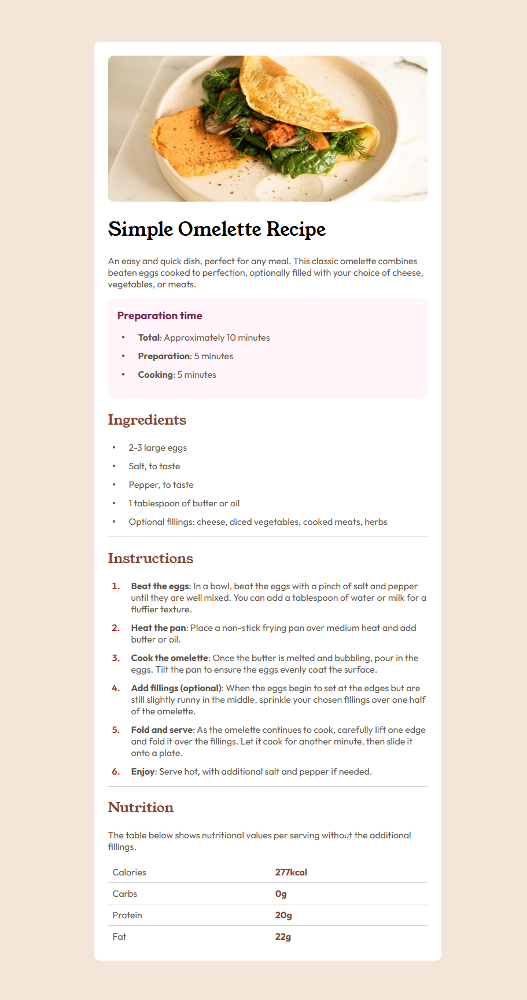

# Frontend Mentor - Recipe page solution

This is a solution to the [Recipe page challenge on Frontend Mentor](https://www.frontendmentor.io/challenges/recipe-page-KiTsR8QQKm). Frontend Mentor challenges help you improve your coding skills by building realistic projects. 

## Table of contents

- [Overview](#overview)
  - [The challenge](#the-challenge)
  - [Screenshot](#screenshot)
  - [Links](#links)
- [My process](#my-process)
  - [Built with](#built-with)
  - [What I learned](#what-i-learned)
- [Author](#author)

## Overview

### Screenshot

### Links

- Solution URL: [Source Code](https://github.com/axah37/frontend-mentor-recipe-page)
- Live Site URL: [Live Site](https://axah37.github.io/frontend-mentor-recipe-page/)

## My process

### Built with

- Semantic HTML5 markup
- CSS custom properties
- Flexbox
- Mobile-first workflow

### What I learned

In this challenge, I learned how to change list markers and use custom markers. I used this to create the small bullets required by the design. I also learned how to style lists including order and unordered lists and tables.

## Author

- Frontend Mentor - [@axah](https://www.frontendmentor.io/profile/axah37)
- Github - [@axah](https://www.github.com/axah37)